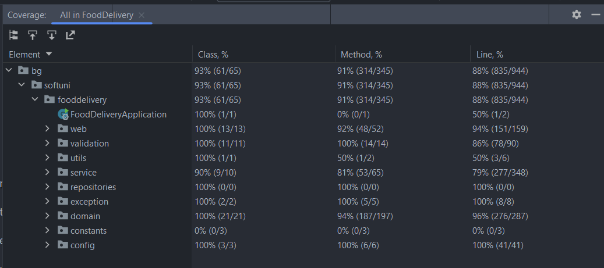

# FoodDelivery

[//]: # (This is my final project for SoftUni Java Web module. It's made during Spring Advanced course in SoftUni and has only educational purpose at this moment.)
[//]: # (The project is still in progress. Until 9th April it will be ready for the online project defense. After that with all new knowledge, I'll continue developing it.)

Overview:
-----------------

Food Delivery is a web application for making food orders from restaurants.
Before registration, you can only view the menu and maybe choose a dish or dishes.
After registration and login you can add some products to your cart, contact number and address for delivery and
make an order.

[//]: # ()

[//]: # (Pages:)

[//]: # (--------------------------------------------)

[//]: # ()

[//]: # (  - Contact us page:)

[//]: # ( ![img_5.png]&#40;img_5.png&#41;)

[//]: # ()

[//]: # (  - Menu page:)

[//]: # ( ![img_6.png]&#40;img_6.png&#41;)

[//]: # ()

[//]: # (  - Menu - category page with anonymous user or worker:)

[//]: # (![img_8.png]&#40;img_8.png&#41;)

[//]: # ()

[//]: # (  - Register page:)

[//]: # (![img_9.png]&#40;img_9.png&#41;)

[//]: # (  - Login page:)

[//]: # (![img_10.png]&#40;img_10.png&#41;)

[//]: # (  - Home page:)

[//]: # (  ![img_11.png]&#40;img_11.png&#41;)

[//]: # (  - Menu - category page with admin user:)

[//]: # (![img_12.png]&#40;img_12.png&#41;)

[//]: # (  - Product edit page:)

[//]: # (![img_13.png]&#40;img_13.png&#41;)

[//]: # (  - All orders history page with admin or worker logged:)

[//]: # (![img_14.png]&#40;img_14.png&#41;)

[//]: # (  - Order's details page:)

[//]: # (![img_15.png]&#40;img_15.png&#41;)

[//]: # (  - All users page:)

[//]: # (![img_16.png]&#40;img_16.png&#41;)

[//]: # (  - User's details page with admin logged:)

[//]: # (![img_17.png]&#40;img_17.png&#41;)

[//]: # (  - Add product page:)

[//]: # (![img_18.png]&#40;img_18.png&#41;)

[//]: # (  - Personal information with admin logged:)

[//]: # (![img_20.png]&#40;img_20.png&#41;)

[//]: # (  - Personal information page with worker or user logged:)

[//]: # (![img_21.png]&#40;img_21.png&#41;)

[//]: # (  - Edit username page:)

[//]: # (![img_22.png]&#40;img_22.png&#41;)

[//]: # (  - Menu - category page with user:)

[//]: # (![img_23.png]&#40;img_23.png&#41;)

[//]: # (  - Cart page:)

[//]: # (![img_24.png]&#40;img_24.png&#41;)

[//]: # (  - Finalize order page:)

[//]: # (![img_26.png]&#40;img_26.png&#41;)

[//]: # (  - Orders history for authenticated user page:)

[//]: # (![img_27.png]&#40;img_27.png&#41;)

[//]: # (  - Page for closed restaurant:)

[//]: # (![img_25.png]&#40;img_25.png&#41;)

[//]: # ()

Functionalities:
-----------------------------------------------------

Before registration people can view the menu and submit something in the contact form.

There are three types of users: ADMIN, WORKER, USER.
After registration, everyone automatically gets the "USER" role.
After that, only the admin is able to change roles.

ADMIN functionalities

- The admin of the application is one person, who is manually set up
- View all users along with their details and change their roles (add or remove user role "WORKER")
- View all orders' history and finish or cancel orders 
- Add, edit or delete product from the menu
- View its personal information, but cannot edit anything

WORKER functionalities:

- Manually set up workers are two - with usernames "workerOne" and "workerTwo"
- Only view the menu
- View all orders' history and finish or cancel orders
- View its personal information and edit username

USER functionalities:

- Manually set up workers are two - with usernames "workerOne" and "workerTwo"
- Add products to the cart
- Remove products from the cart
- Make orders
- View its own orders' history and orders' details
- View its own cart
- View its own personal information and edit username
- View contact form and submit some message

Test accounts:
---------------------------------------------

Password for all: "topsecret"

Role admin:

- username: admin

Role worker:

- username: workerOne
- username: workerTwo

Role user:

- username: nikol
- username: ivan

SoftUni additional requirements:

- Interceptor: the working time of the restaurant is 11AM-10PM. Outside the working hours when a logged user tries to make
  order, it will be redirected to page which will inform user with the working time.
- Fetch: displaying order's details
- Error handling: global controller advice for not found object, specific controller exception for wrong menu category.
Whitelabel error page replaced with custom error.html page.
- Scheduled jobs - Every day, there are promotions. Depending on the day of week, some products have lower prices.
- Test coverage: 

Food Delivery Project - Nikol Georgieva - 2023 &copy; All rights reserved.